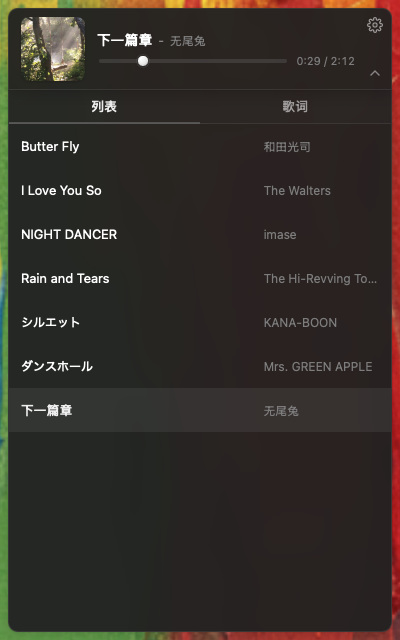

# TingMusic

一个浮在桌面上的小巧本地音乐播放器,Tauri 2 + React 写的。
默认是一张半透明卡片,点右下角箭头可以展开成完整面板(列表 / 歌词)。

<p align="center">
  
  <br>
  
</p>

## 特性

- **悬浮卡片窗口** —— 无系统标题栏 / 最大最小化按钮(`decorations: false` + `transparent: true` + `macOSPrivateApi: true`)。按住卡片任意空白处可拖到桌面任何位置。
- **三段式窗口** —— 紧凑(400×100,只有卡片)/ 设置(400×580)/ 展开(400×640,卡片 + Tabs + 列表/歌词面板)。状态切换有 240ms ease-out 滑动动画,展开后卡片与下方 panel 拼成一整块。
- **本地曲库扫描** —— 默认读 `~/Music`,首次启动自动扫描;通过齿轮菜单可重新选择曲库。递归扫描,支持 `mp3 / flac / wav / ogg / m4a / aac`。
- **黑胶风占位封面** —— 没封面的歌显示一张圆形黑胶(中心红色标签),播放时缓慢旋转(20 秒一圈),暂停时停在当前角度。设置里可切换"圆形 / 方形"。
- **自动联网拉封面** —— 没内嵌封面的歌走 iTunes Search API,拿 600×600 JPEG,缓存到 `app_cache_dir/covers/<track_id>.jpg`,以后秒出。失败静默回落到占位图。
- **滚动同步歌词** —— 优先读 sidecar `.lrc`(容忍 `Song#hash.mp3` ↔ `Song.lrc` 这种网易云/QQ 缓存哈希命名差异),否则读 ID3 USLT 内嵌歌词,二分查找精确高亮 + 平滑居中滚动。
- **三种播放模式** —— 顺序(到末尾自动回首)/ 随机(避免立即重复当前)/ 单曲循环。
- **两套主题** —— 默认灰(暗色 + 灰调强调)/ 白红(白底 + 红色强调,网易云外链播放器风格)。
- **首次播放语义** —— 启动后封面显示曲库第一首,但不开始播放;点封面才进入播放。
- **空格快捷键** —— 全局空格切换播放/暂停(焦点在按钮/输入框时不冲突)。
- **持久化** —— 曲库路径、音量、模式、封面形状、主题,都保存到 `app_config_dir/config.json`,损坏自动用默认值覆盖。
- **进度条 seek 真实快** —— rodio 0.22 + symphonia 后端 + `Sink::try_seek`,跳几分钟也能秒到。松手后 350ms 内不会被在途的进度推送回退,所以不闪。
- **设置整合到齿轮** —— 选择曲库 / 音量(带喇叭+声波图标)/ 播放顺序 / 封面形状 / 主题 / 退出,全部在右上角齿轮的下拉菜单里;选项是横排胶囊按钮,激活态填红边。
- **文件名兜底元数据** —— 没有 ID3 的 mp3(常见于 yt-dlp 输出)按 `Title-Artist.mp3` 命名时,自动从文件名提取标题和艺术家;`#hash` 缓存后缀被去掉。
- **macOS dock 图标自定义** —— dev/prod 模式都通过 `NSApplication.setApplicationIconImage:` 在启动时塞进黑胶封面图,不依赖 bundle Info.plist。

## 技术栈

| 层 | 选择 | 备注 |
|---|---|---|
| Shell | Tauri 2 | `decorations: false`, `transparent: true`, `macOSPrivateApi: true`,Cargo `macos-private-api` feature |
| 前端 | React 18 + TS + Vite | 单页,体积约 58 KB gzip |
| 状态 | zustand 4 | 轻量、Hook 风格 |
| 音频 | rodio 0.22(`playback` + `symphonia-all`) | mp3 / flac / wav / aac / ogg / m4a 都走 symphonia,seek 用 demuxer 的 seek 表 |
| 元数据 | lofty 0.21 | 标题 / 艺术家 / 专辑 / 时长 / 封面 / 内嵌歌词 |
| 文件遍历 | walkdir 2 | 支持递归 |
| HTTP | reqwest 0.12 (`rustls-tls`) | iTunes Search,8s 超时 |
| 序列化 | serde / serde_json | 一份 `config.json`,字段加 `#[serde(default)]` 向后兼容 |
| 锁 | parking_lot | 比 std::sync 简洁 |
| macOS FFI | objc2 + objc2-app-kit | 仅用于 dev 模式 dock 图标 |
| 哈希 | sha2 + hex | 文件路径前 8 字节作 track id |

## 目录结构

```
TingMusic/
├── src/                          前端
│   ├── App.tsx                   窗口尺寸编排 + 顶层布局 + 空格快捷键
│   ├── store.ts                  zustand store
│   ├── lib/{api,types}.ts        Tauri command 包装 + 共享类型
│   └── components/
│       ├── NowPlaying.tsx        卡片(封面 + 标题 + Progress + Settings + 展开按钮)
│       ├── Progress.tsx          进度条(松手才发 seek + 350ms 冻结防回退)
│       ├── Settings.tsx          齿轮下拉(曲库 / 音量 / 顺序 / 形状 / 主题 / 退出)
│       ├── Tabs.tsx              列表 / 歌词 切换
│       ├── Playlist.tsx          虚拟滚动列表(react-window)
│       └── Lyrics.tsx            同步滚动歌词
├── src-tauri/                    后端
│   ├── tauri.conf.json
│   ├── capabilities/main.json    ACL(set-size / close / drag / dialog)
│   └── src/
│       ├── lib.rs                Tauri commands + 100ms 进度推送 + 自动切歌 + dock 图标
│       ├── types.rs              Track / Mode / Lyrics / Config / CoverShape / Theme
│       ├── config.rs             JSON 持久化 + 损坏自愈
│       ├── lyrics.rs             LRC 解析 + sidecar 查找(带 # 后缀容错)+ lofty 内嵌回退
│       ├── scanner.rs            walkdir + lofty + 元数据 + base64 封面 + 文件名兜底解析
│       ├── player.rs             rodio Player 包装 + 模式状态机 + SendDevice 包装
│       └── cover_fetch.rs        iTunes Search + 本地缓存
├── scripts/
│   ├── make_icon.py              用 Pillow 生成黑胶 app icon
│   └── lrc_to_hiragana.py        日文 .lrc → 纯平假名(用 pykakasi)
└── docs/
    ├── screenshots/              README 截图
    └── superpowers/{specs,plans} 设计与实现文档
```

## 开发

```bash
npm install
npm run tauri dev
```

首次 cargo build 会拉一坨依赖(symphonia / reqwest / tauri / objc2 等),要等几分钟。

测试:

```bash
npm test                                 # 前端 (vitest)
cd src-tauri && cargo test --lib         # Rust
```

约 14 个前端测试 + 31 个 Rust 单元测试。

## 打包

```bash
npm run tauri build
```

产物在 `src-tauri/target/release/bundle/`。第一次构建很慢,后续增量构建快。

## 配色与设计原则

- **整体灰调(默认主题)** —— 卡片用 `light-dark(rgba(255,255,255,0.95), rgba(36,36,36,0.95))`;高亮文字用 `--hi`(亮模式深灰、暗模式接近白)。
- **唯一彩色锚点** —— 黑胶占位封面中心的红色标签(`#d33a31`)是默认主题里唯一保留的色彩,避免暗模式下"红+白"的视觉刺眼。
- **白红主题** —— 反过来强调红色:白卡 + 红色激活态(标题/激活页签/激活行/封面播放按钮),适合习惯"网易云外链播放器"调性的用户。
- **珍珠风手柄** —— 进度条和音量滑杆的 thumb 用径向渐变 + 内嵌高光 + 外晕做出 3D 立体感。
- **拖拽来源是卡片** —— `data-tauri-drag-region` 标在卡片根 + meta 区域;封面按钮 / 设置 / 进度条 / 展开按钮等交互元素天然不参与拖动。

## 已知边界

- **macOS 优先** —— `transparent: true` + `macOSPrivateApi` + `objc2-app-kit` 都是 macOS 特化路径;Windows/Linux 上窗口可能显示为不透明矩形,代码不阻断跨平台编译,但视觉效果未验证。
- **退出** —— 没有系统关闭按钮,Cmd+Q 或齿轮菜单里的「退出」都可。
- **不持久化播放进度** —— 每次启动从第一首歌开始(展示元数据,点封面才开始播放),不接续上次位置。这是设计选择,与"小巧"诉求一致。
- **iTunes Search 不是百分百覆盖** —— 中文 / 日文小众歌可能查不到,这种情况维持黑胶占位。
- **没有删除曲目错误的 toast** —— 若文件被外部删除后点播放,会失败但 UI 没有显式提示。

## 工具脚本

- `scripts/make_icon.py` —— 重新生成 dock app icon(深色磨砂底 + 黑胶 + 红色中心标签)。
- `scripts/lrc_to_hiragana.py [dir]` —— 把指定目录(默认 `~/Music/TingMusic`)下的日文 `.lrc` 转成纯平假名,原文件备份成 `.lrc.bak`。需要 `pip install pykakasi`。

## 许可

MIT。
